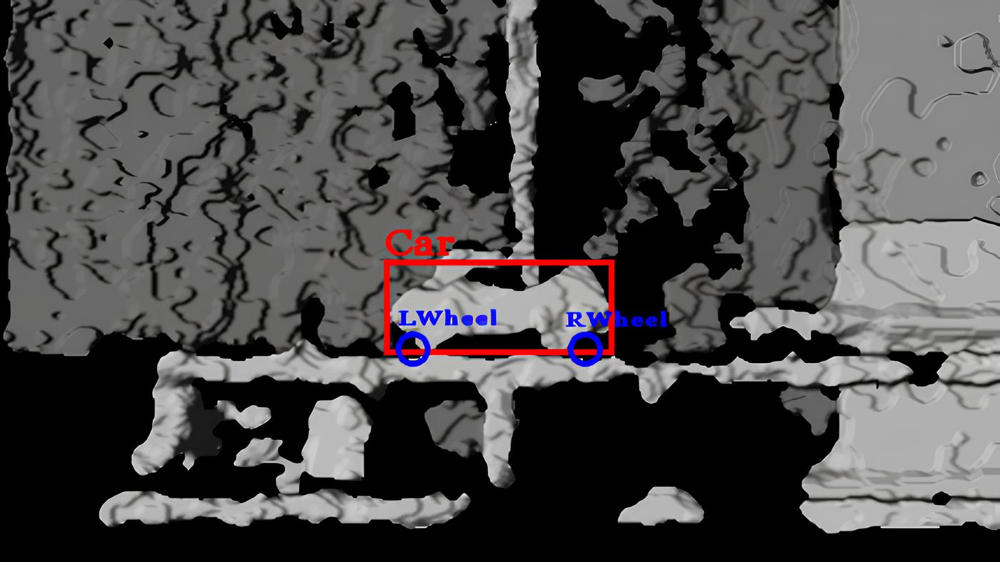
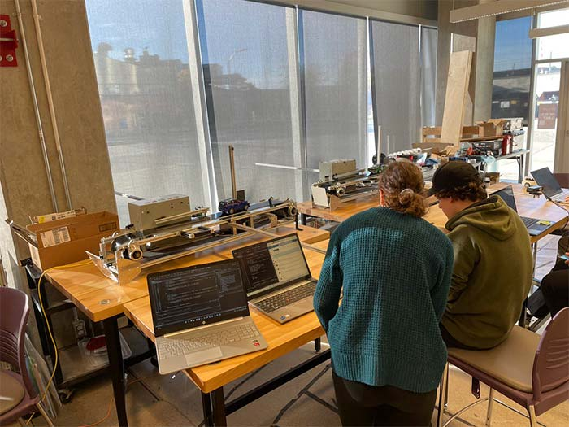
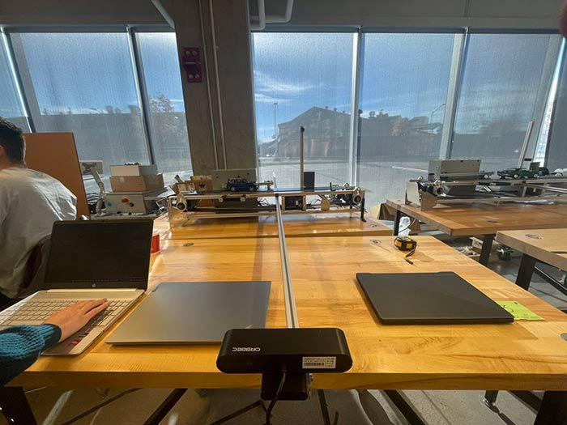
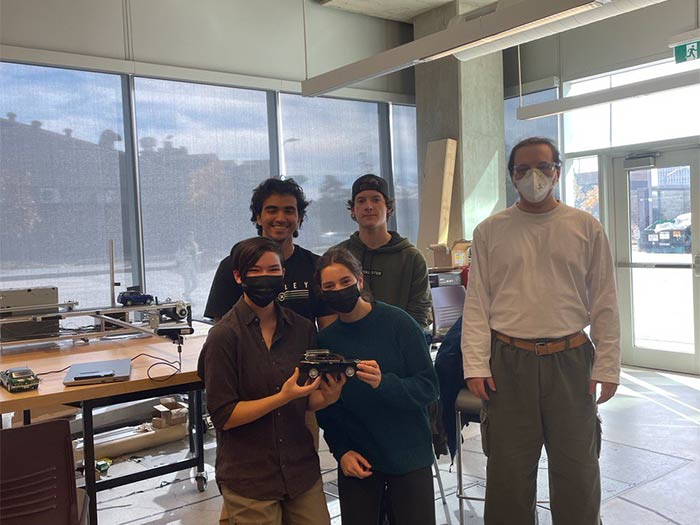
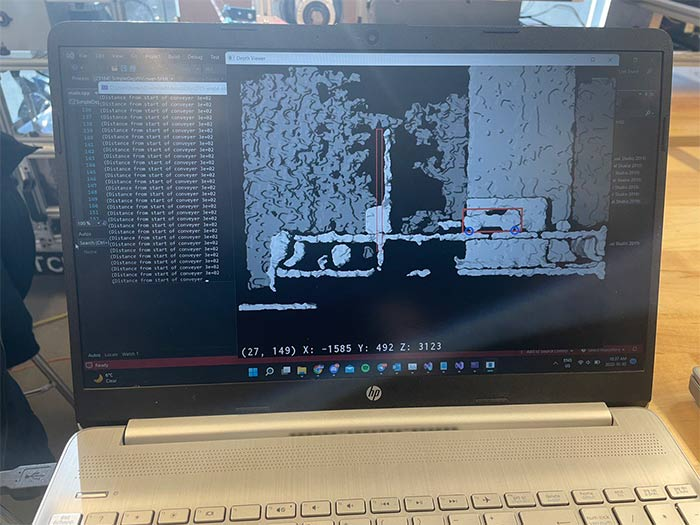

# Toyota Challenge

	

Won first place for fastest completion time and best presentation

## Main Objective

Take a picture of the car when the front wheel of passes an indicated post.

## Steps

These are the steps our group took in order to complete the challenge, these were carefully cordinated to achieve the fastest completion time:

1. Take inputs from an Astra Series-Orbbec 3D camera and read the depth values.
2. Eliminate the noise and predict the vague location of the car
3. Using the provided libraries label and draw a box around the car
4. Narrow down the location of the wheels from the cars cordinates
5. Locate the objective post
6. Draw the circles around the wheels and take a picture of the image when front wheel crosses the post

# Challenges Faced

- Depending on the time of the day, the camera had a diffiult time picking up depth values

# Gallery

	

		<a href="#slide-4">Previous</a> | <a href="#slide-2">Next</a>
	

	
	
1 / 4

	

		<a href="#slide-1">Previous</a> | <a href="#slide-3">Next</a>
	

	
	
2 / 4

	

		<a href="#slide-2">Previous</a> | <a href="#slide-4">Next</a>
	

	
	
3 / 4

	

		<a href="#slide-3">Previous</a> | <a href="#slide-1">Next</a>
	

	
	
4 / 4

